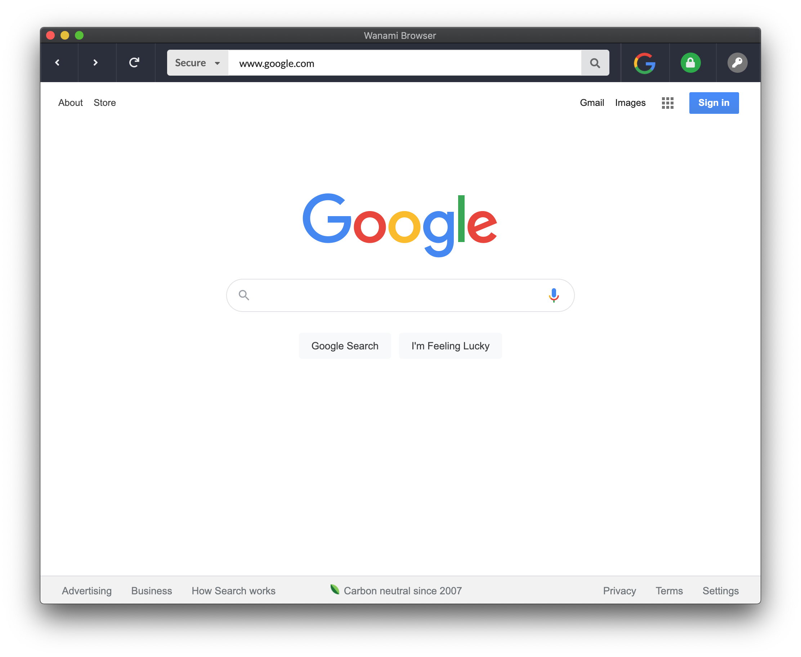
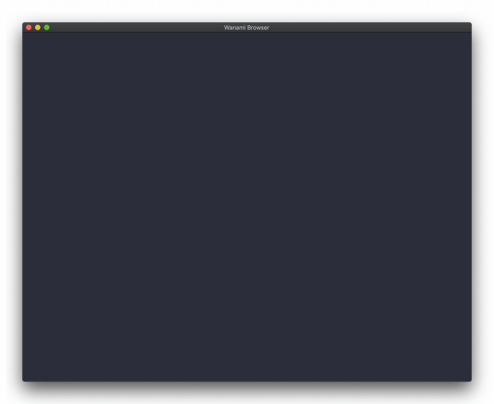
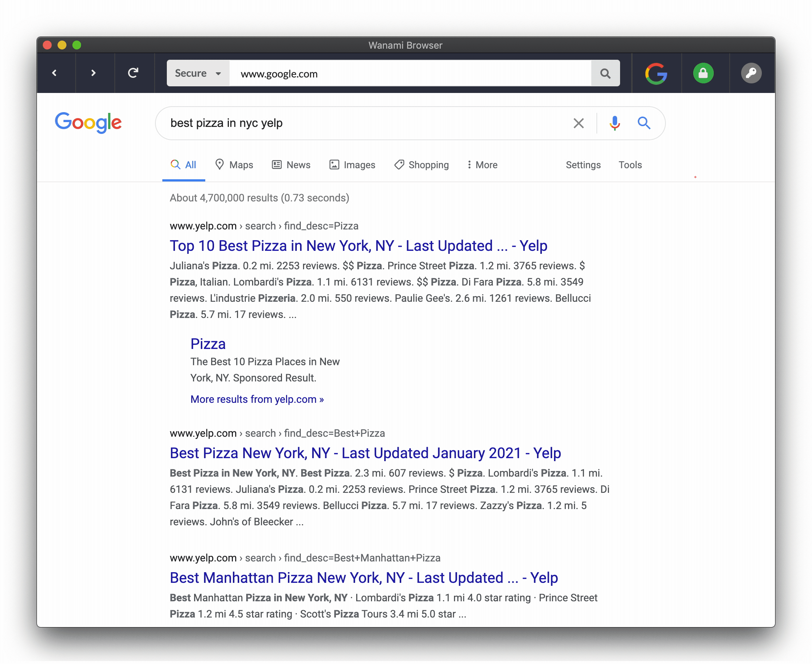
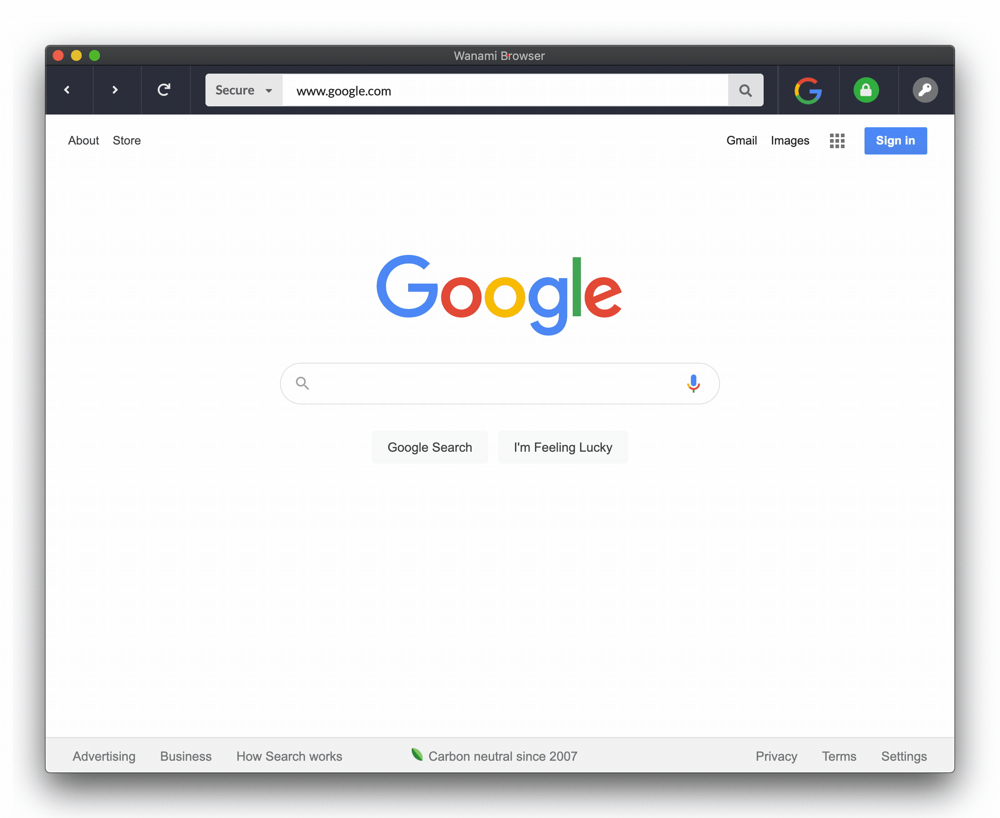
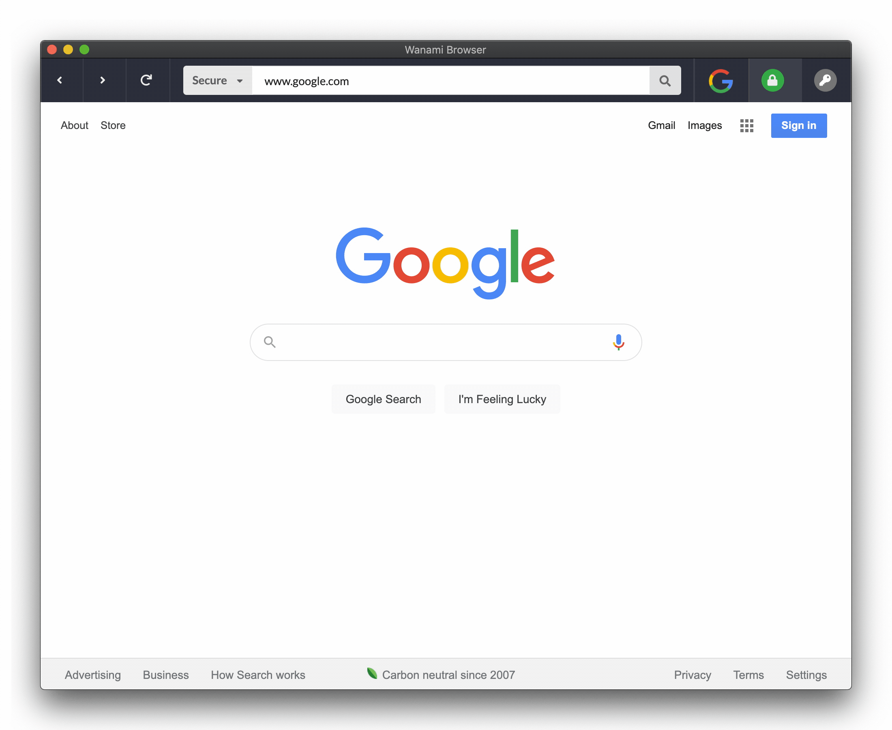
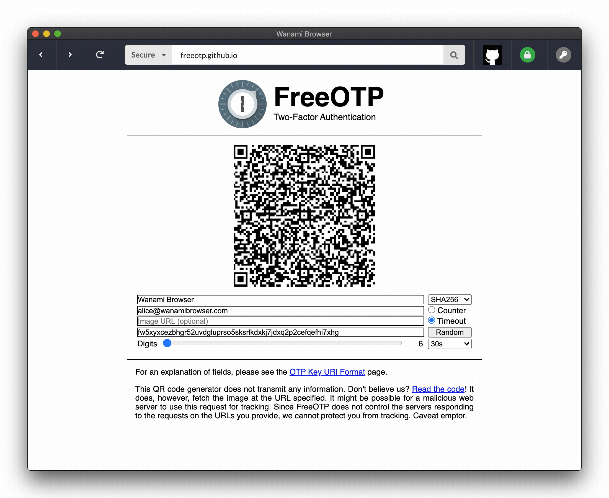
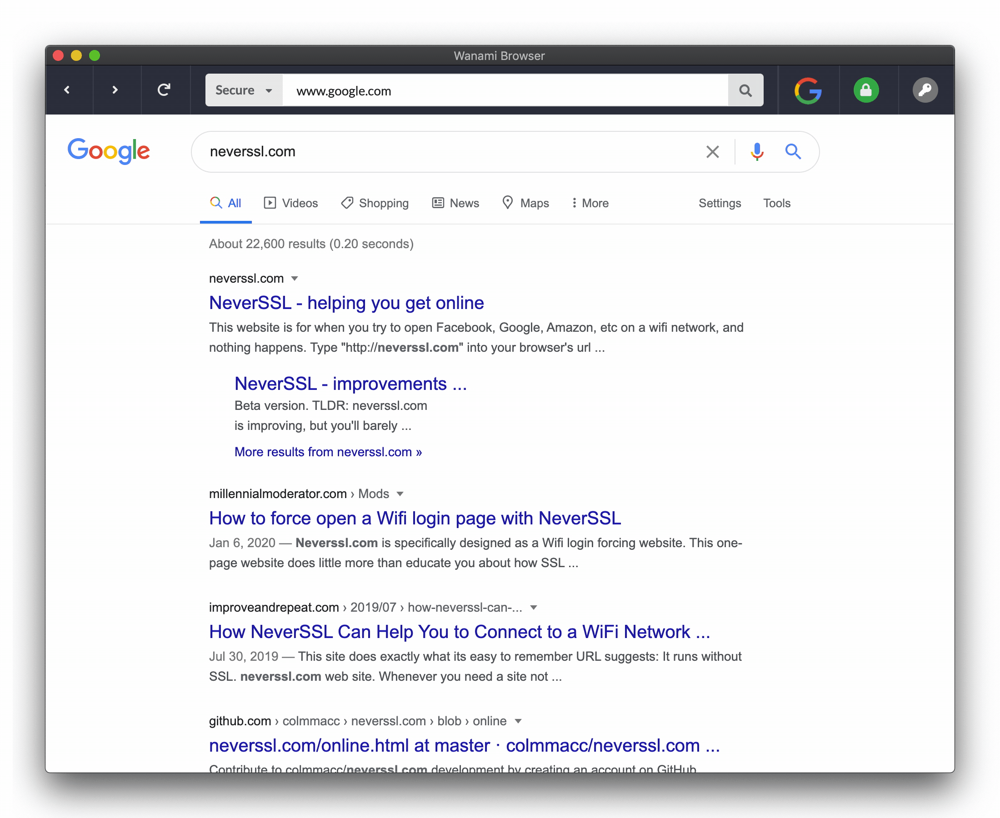

<p align="center">
  
</p>
<h1 align="center">Wanami Browser (Alpha)</h1>
<h3 align="center">Preventing high risk, low visibility web cybersecurity concerns through simplicity, alerting and built-in features.</h3>
<p align="center">
  
  <a href="https://github.com/401unauthorized/wanami-browser#readme" target="_blank">
    
  </a>
  <a href="https://github.com/401unauthorized/wanami-browser/graphs/commit-activity" target="_blank">
    
  </a>
  <a href="https://github.com/401unauthorized/wanami-browser/blob/master/LICENSE" target="_blank">
    
  </a>
  <a href="https://twitter.com/stephenmendez_" target="_blank">
    
  </a>
  <a href="https://paypal.me/stephenmendez401" target="_blank">
    
  </a>
</p>

## 🖥 Application 

<p align="center">
  This project was created by <a href="#-author">Stephen Mendez</a> as part of his Master's in Cybersecurity capstone project.
</p>
<p align="center">
  Please visit <a href="https://www.wanamibrowser.com" target="_blank">https://www.wanamibrowser.com</a> for more information and to download the <a href="https://www.wanamibrowser.com/wanami.pdf" target="_blank">research paper</a>!
</p>
<p align="center">
  Wanami Browser is an early stage proof of concept and should be used for research purposes only.
</p>

<div align="center">
  
</div>

> "Wahoo" + "Namaste" = "Wanami"
> 1. **Wahoo** is a fish best known for its speed, quality and challenge to catch
> 2. **Namaste** is a salute of respect and commonly used in yoga practice
> * A perfect name for a peaceful anti-phishing web browser!

## 🔮 Motivation

### Introduction

1. While the barrier to entry for using a web browser is relatively low, there are considerable and sometimes hard to detect cybersecurity risks for inexperienced or untrained users. 

2. This project aimed to disrupt the conventional web browsing experience through focusing on preventing high risk but low visibility web based cybersecurity concerns, such as phishing, web cloning and insecure sites with an emphasis on prominently notifying the end user of potential concerns.

3. The end result was the creation and release of an open source web browser, Wanami, which demonstrates traditional (basic) web browsing capabilities and enhanced cybersecurity protection features such as improved end user cyber awareness to promote an overall safer browsing experience.

### Focus Areas

#### URL Input Field

| Industry                                                      | Wanami                                                        |
|---------------------------------------------------------------|--------------------------------------------------------------|
| Requires knowledge of networking protocols (HTTPs, HTTP, etc) | Remove the requirement to understand protocols               |
| Must understand the nuances of the domain name system (DNS)   | Reduce the complexity of URL structure down to simplest form |
| Recognize the parts of a URL                                  | Ensure information is clearly presentable                    |


#### Trust Information

| Industry                                                                   | Wanami                                                                         |
|----------------------------------------------------------------------------|-------------------------------------------------------------------------------|
| Requires knowledge of secure computing such as encryption and certificates | Simplify the knowledge requirements for end users                             |
| Must be able to understand complex visual indicators and alerts            | Visualize the information so that it is easy to reference but not distracting |
| Must validate website manually                                             | Automatically obtain information about the website to present to the user     |

#### Security Alerting

| Industry                                                     | Wanami                                                                       |
|--------------------------------------------------------------|-----------------------------------------------------------------------------|
| Warnings are presented in a variety of ways                  | Presents the warnings in a standardized way so the user becomes comfortable |
| Some indications are less noticeable or confusing in wording | Use simple wording and statements with the non-technical user in mind       |
| Some notices are disruptive to the browsing flow             | Promptly notify but do not disrupt                                          |

### Key Features

- [Password Protection](#password-protection)
  - Only allow those with your password to access the web browser.
- [Protocol Selection](#protocol-selection)
  - HTTPS. HTTP. What do they even mean? Select from "Secure" or "Legacy" instead.
- [Shortened URLs](#shortened-urls)
  - Shorten the URL down to the domain name when not interacting with the input field.
- [Owner Information](#owner-information)
  - Wanami determines who owns the website and shows their logo and detailed infromation.
- [Security Warnings](#security-warnings)
  - Insecure website? Expired certificate? Phishing website? Wanami will detect and react.
- [Built-in MFA/2FA](#built-in-mfa-2fa)
  - Virtually scan MFA QR Codes and store TOTP/HOTP codes right in the browser. Simpler than SMS or Google Authenticator.
- [Alerting](#alerting)
  - Wanami will let you know when something seems wrong in a clear and easy to recognize way.

## 💾 Installation

This repo should be cloned to your machine and dependencies installed:

`$ git clone https://github.com/401unauthorized/wanami-browser.git && cd wanami-browser && npm i`

## 🔌 Quick Start

The application is based on the [Electron](https://www.electronjs.org) framework.

Run the CLI command to start the application:

`$ npm run dev`

## 👓 Transparency

- Development up to 1.0.0 was completed as part of the original developer's Master's in Cybersecurity capstone project.
- There are no plans for continued development, maintenance or support. Consider this proof of concept deprecated unless stated otherwise.  
- This works well on the developer's computer. You should expect it not to work on your computer. If it does work, awesome!
- Should not be considered "production ready", used in critical, secure or typical environments.
- Additional [security concerns & known vulnerabilities](https://github.com/401unauthorized/wanami-browser/blob/master/SECURITY.md) should be reviewed and acknowledged prior to running the application
- You may have noticed there are no tests of any type. This may or may not change in the future. A TDD approach without the T.

## 🛠 Development Setup

### Third Party APIs

In current implementation, this project uses some private, paid API's for full functionality.

The project **can** be used without these API's but some functionality is going to be limited.

### config/.env

This file is used to store persistant environmental variables and sensitive information for the application during development.

After installation, it is advised to create this file and populate it with the following:

- `ENABLE_COMPANY_DATA` is the feature flag for using the Uplead API
  - When enabled, `UPLEAD_API_TOKEN` must also be set
- `ENABLE_URL_CHECK` is the feature flag for using the APIVOID API
  - When enabled, `APIVOID_API_TOKEN` must also be set

Please review the [security concerns & known vulnerabilities](https://github.com/401unauthorized/wanami-browser/blob/master/SECURITY.md) to determine if you would like to enable or disable these features.

```BASH
ENABLE_COMPANY_DATA=false
UPLEAD_API_TOKEN=<API-TOKEN-HERE>
ENABLE_URL_CHECK=false
APIVOID_API_TOKEN=<API-TOKEN-HERE>
```

## 📦 Files & Storage

#### otp-mfa-store.json

An encrypted JSON file for storing TOTP/HOTP configurations and metadata

> Location dependant on OS. OSX it is `~/Library/Application Support/Wanami Browser/otp-mfa-store.json`.

Object Model
- **otp:** An serialized TOTP/HOTP object
- **metadata:** An object of supporting metadata such as domain name

## 🎛 Details

### Password Protection
  - User creates a password the first time they run the application
  - Argon2 hash of password is securely stored in OS native key store
  - Password is used for encryption of sensitive configurations and files
  - Application is not accessible without a password

<div align="center">
  
</div>

### Protocol Selection
  - Moved outside of the input field
  - Fixed dropdown options are “Secure” (https) and “Legacy” (http)
  - Handles automatic updating based on the final loaded URL
  - Protocol will be stripped from the input field if typed/pasted by the user
  - Feedback via color for alerting

<div align="center">
  
</div>

### Shortened URLs
  - Entire URL will be shown during user interaction
  - Automatically hides all parts of the URL except for the domain name on focus change
  - Retains full URL information in state
  - Feedback via color for alerting

<div align="center">
  
</div>

### Owner Information
  - Determines website owner and displays the company logo 
  - Logo will appear inside the taskbar, in a fixed position
  - Favicons are not used as to avoid confusing the user
  - Additional company information is available by clicking the logo to open a modal
  - If there are any concerns, a user can navigate back from modal

<div align="center">
  
</div>

### Security Warnings
  - Dynamically determines the safety and security of all websites visited based on some algorithms
  - Provides simple information to the end user based on security metrics
  - Optionally integrated with threat detection services for real-time vulnerability detection

<div align="center">
  
</div>

### Built-in MFA 2FA
  - Directly built into the web browser without the need to use a mobile app or SMS
  - Securely scan the webpage for any valid OTP based QR Codes
  - Codes are stored encrypted on disk using a password defined by the end user
  - Supports both TOTP/HOTP codes

<div align="center">
  
</div>

### Alerting
  - If a page is loaded over HTTP, the protocol will switch to “Legacy” and change to be red
  - The URL input field will turn slightly red to indicate a potentially misleading URL
  - When a company (or logo) is unknown, the icon will pulse an orange question mark
  - When there are security concerns, the security icon will display a red exclamation mark
  - A native OS notification will be delivered

<div align="center">
  
</div>

## 👤 Author

 **Stephen Mendez**

- Website: [https://www.stephenmendez.dev](https://www.stephenmendez.dev#gh-wanami)
- Twitter: [@stephenmendez\_](https://twitter.com/stephenmendez_)
- Github: [@401unauthorized](https://github.com/401unauthorized)

## 🎨 Logo & Icon Designer

 **Roman Korolev**
- Website: https://dribbble.com/Kaer

## 🤝 Contributing

Contributions, issues and feature requests are welcome!<br />Feel free to check [issues page](https://github.com/401unauthorized/wanami-browser/issues). You can also take a look at the [contributing guide](https://github.com/401unauthorized/wanami-browser/blob/master/CONTRIBUTING.md).

## 😃 Show your support

Give a ⭐️ if this project interests you!

Consider making a donation of any amount!

<a href="https://paypal.me/stephenmendez401" target="_blank">
  
</a>

## 📝 License

Copyright © 2020 Stephen Mendez<br />
This project is [MPL-2.0](https://github.com/401unauthorized/wanami-browser/blob/master/LICENSE) licensed.

Please note, permission is not granted to use the trade names, trademarks, service marks, or product names except as required for reasonable and customary use in describing the origin of the project.

---
_Part of this README was generated with ❤️ by [readme-md-generator](https://github.com/kefranabg/readme-md-generator)_

<p align="center">
  
</p>


